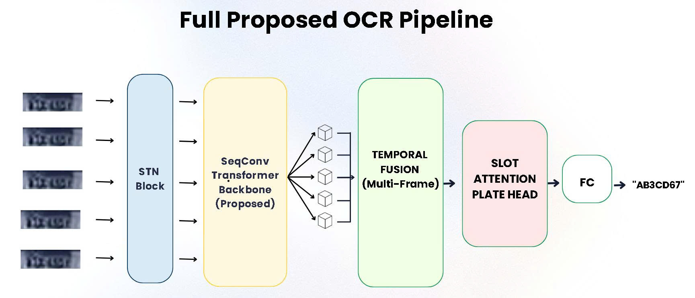
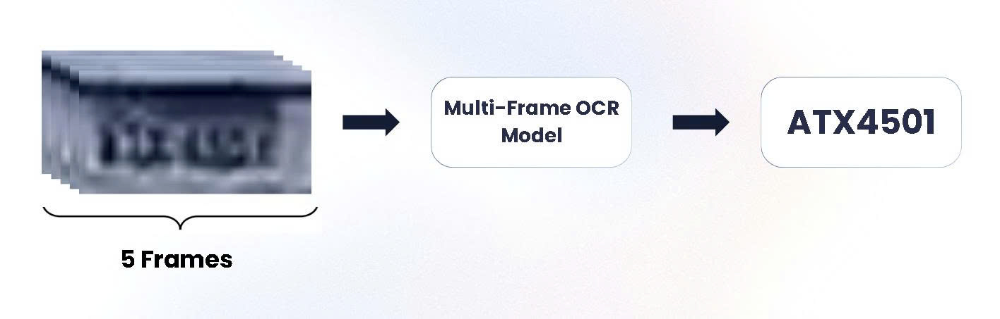
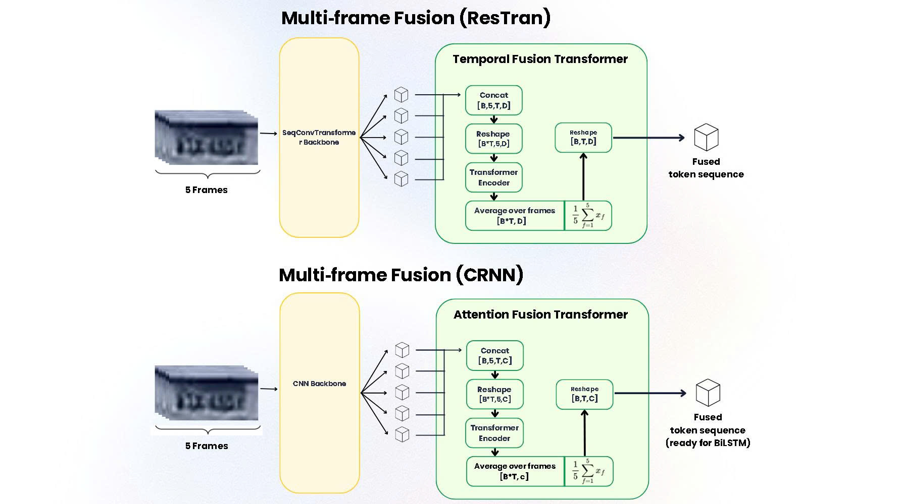

<div align="center">

  # OCR-LOW-RESOLUTION-PLATE-ICPR

  ### Multi-Frame (5 frames) License Plate Recognition with Fusion Ablations, Backbone Comparison, and Confidence-Aware Correction

  <!-- General -->
  <h3>General</h3>

  <p>
    <a href="https://github.com/minhthai-code/OCR-ICPR-CHALLENGE"></a>
    <a href="https://www.python.org/downloads/"></a>
    <a href="https://www.apache.org/licenses/LICENSE-2.0"></a>
    <a href="#"></a>
  </p>

  <!-- Project -->
  <h3>Project</h3>

  <p>
    <a href="https://icpr26lrlpr.github.io/"></a>
    <a href="https://www.kaggle.com/code/thitrnminh/ocr-icpr-training-notebook"></a>
    <a href="#"></a>
    <a href="#"></a>
  </p>

  <p>
    <em>
      A research codebase for low-resolution license plate recognition from
      multiple frames, designed to systematically study temporal evidence,
      backbone capacity, and confidence-aware correction.
    </em>
  </p>
</div>

---


This repository contains the implementation and experiments for a research project by **[Tran Minh Thai](https://github.com/minhthai-code)** on recognizing license plates from **multiple low‑resolution frames**. The system is designed for the **[ICPR 2026 Low-Resolution License Plate Recognition challenge](https://icpr26lrlpr.github.io/)** and studies how temporal evidence, geometric rectification, and transformer‑based decoding can improve robustness under blur, compression, and motion distortion.

## Abstract



Low‑resolution license plate recognition is difficult because individual frames often contain incomplete strokes, heavy blur, motion distortion, or missing characters. In many cases, no single frame is sufficient, but a short sequence may contain complementary evidence. This project investigates whether recognition can be improved by aggregating evidence across a short frame sequence instead of relying on a single image. We propose a multi‑frame OCR pipeline with configurable backbone choices, optional spatial alignment, temporal fusion, and structured decoding. The repository is organised to support controlled ablations and reproducible competition experiments.
> **What is the best way to exploit multiple noisy frames for license plate recognition under blur, compression, motion, and partial occlusion?**

The competition inspired us to ask this broader research question. The core goal is not only to build a strong multi‑frame OCR system, but also to answer it systematically. We break this down into four specific ablation studies:

- **Part 1 – Does multi‑frame help?** Compare single‑frame vs. multi‑frame inside each model family (CRNN and ResTran).
- **Part 2A – Which backbone is best? (all trained from scratch)** Compare ResNet34, Proposed, and SVTRv2 without any pretraining.
- **Part 2B – Does pretraining help?** Measure the gain from ImageNet/OpenOCR pretraining on ResNet34 and SVTRv2.
- **Part 3 – Which fusion strategy is best?** Keep the best backbone and compare early stacking, mean pooling, attention, transformer, and reliability‑weighted fusion.
- **Part 4 – Do STN, motion alignment, and refinement help?** Toggle these modules on/off while keeping the best backbone + fusion.

## What is new compared with prior multi‑frame LPR work?

Unlike existing multi‑frame LPR systems that focus on a single architecture, this project provides:

- **A systematic four‑part ablation study** – multi‑frame benefit, backbone comparison (within fixed model family), fusion strategy ablation, and correction modules ablation.
- **A backbone comparison framework** – spanning a pretrained CNN (ResNet34), Lightweight Sequence-Oriented Conv-Transformer Encoder (proposed), and a high‑capacity SVTRv2 reference.
- **Confidence‑aware selective correction** – to reduce errors on ambiguous character pairs (e.g., `0/O`, `1/I`, `5/S`).
- **A reproducible ablation pipeline** – with clear reporting of efficiency vs accuracy trade‑offs.
- **Clear separation of model families** – ResTran (late fusion, structured decoding) and CRNN (early fusion baseline) are independent internally but share the same experimental protocol.

## Problem Setting

The task is to predict the license plate text from a sequence of **five low‑resolution frames**. During training, high‑resolution reference images are also available, but the final prediction uses the low‑resolution inputs only.

- **Input:** Multi‑frame track `x ∈ [B, F, 3, H, W]`  
- **Default frame count:** `F = 5`  
- **Default input size:** `32 × 128`  
- **Output:** License plate character sequence  
- **Submission format:** `track_id,predicted_text;confidence`

## Key Contributions

1. **Multi‑frame license plate OCR** for low‑resolution sequences rather than single‑image recognition.
2. **Configurable recognition backbones** to compare CNN and transformer‑style feature extraction.
3. **Optional spatial normalisation** using STN and frame alignment modules.
4. **Temporal fusion** to combine information from multiple noisy frames.
5. **Structured decoding head** with slot‑based prediction and optional refinement.
6. **Controlled ablation framework** for backbone, STN, motion alignment, and training strategy comparisons.

## Proposed Method

### Design Principle: Model Families Are Independent Internally

A key design decision in this codebase is that **different model families (ResTran and CRNN) do not need to share the same internal tensor shapes**. For a research‑grade comparison, what must remain consistent is:

- The **dataset protocol** (same tracks, same preprocessing)
- The **training/evaluation protocol** (same epochs, optimizer, metrics)
- The **experiment labels** (clear naming for each ablation)
- The **output contract per model family** (predicted text + confidence)

Thus, the internal operations can differ entirely:

**ResTran** (structured late‑fusion model)  
`[B, F, T, D] → fusion → [B, T, D] → SlotAttention → CTC/refinement`

**CRNN** (simple early‑fusion baseline)  
`[B, F, C, W] → early fusion → [B, C, W] → BiLSTM → CTC`

This architectural freedom allows each model to follow its natural design while being fairly compared under identical experimental conditions. In this codebase:

- **ResTran stays unchanged** – it is the main proposal for late evidence aggregation and structured decoding.
- **CRNN becomes the fusion‑ablation playground** – it tests simple early fusion vs. single‑frame baselines.

We provide **two independent model families** that are compared under identical protocols but have different internal designs.

### 1) CRNN Family (Early Fusion Baseline)

A lightweight baseline for fast sequence recognition. This family is used to study **simple early fusion** strategies (Part 3) and to answer “does multi‑frame help?” (Part 1) in a CNN‑BiLSTM setting.

**Pipeline:**  
`Multi‑frame Input → (Optional Motion Alignment) → (Optional) STN Alignment → Early Fusion (stacking/pooling) → CNN → BiLSTM → CTC`

**Use case:** Strong traditional baseline, fusion‑ablation playground. Internal tensor shape follows `[B, F, C, W]` after CNN, which is collapsed early.

### 2) ResTran Family (Late Fusion, Structured Decoding)

The main proposed model for **late evidence aggregation** and **structured decoding**. It keeps spatial information per frame longer, fuses temporally with attention, then uses slot‑based prediction.

**Pipeline:**  
`Multi‑frame Input → (Optional) Motion Alignment → (Optional) STN Alignment → Backbone → Temporal Fusion Transformer → Slot‑Attention Head → Prediction`

**Main modules:**
- **STNBlock** – learns geometric rectification.
- **Backbone** – one of: ResNet34 (CNN baseline), Lightweight Sequence-Oriented Conv-Transformer Encoder (ours), or SVTRv2 (external baseline).
- **TemporalFusionTransformer** – fuses evidence across frames.
- **SlotAttentionPlateHead** – structured character prediction.
- **Optional refinement branch** – for ambiguous character groups.

**Internal tensor shape:** `[B, F, T, D]` (frame‑wise sequence features) fused to `[B, T, D]`.

### 3) Proposed Backbone: Lightweight Sequence-Oriented Conv-Transformer Encoder (Ours)

A lightweight Conv-Transformer backbone specifically designed for narrow text regions and trained entirely from scratch.

**Pipeline:**  
`Image → Convolutional Downsampling → Height Collapse → 1D Transformer Encoder → Feature Projection`

**Characteristics:**
- Minimal architectural complexity for stable training from scratch.
- Early height collapse to enforce left‑to‑right sequence structure.
- 1D transformer modelling along the width dimension.
- Optimised for low‑resolution, narrow text regions.

**Motivation:** License plates are narrow and highly structured; a full 2D transformer is not always the best fit. This backbone exploits the geometry of the task more directly.

**Positioning:** Implemented in `src/models/proposed.py`. It is used **inside the ResTran family** as one of the backbone options.

### 4) OpenOCR SVTRv2 Baseline (official implementation)

To evaluate the effectiveness of our proposed backbone, we compare against a standard SVTRv2‑style transformer backbone.

**Pipeline:**  
`Image → Patch Embedding → Hierarchical Transformer Blocks → 2D Token Mixing → Feature Projection`

**Characteristics:**
- Maintains full 2D spatial token interactions.
- Uses hierarchical transformer stages.
- Typically benefits from large‑scale pretraining.
- Higher computational cost.

**Role in this work:** Serves as a strong baseline representing high‑capacity transformer‑based OCR models with full spatial modelling.


## Experimental Design: Four Ablation Studies

All experiments use the same training protocol (30 epochs, batch size 64, AdamW, OneCycleLR, augmentation=full, seed=42). The main evaluation metric is character‑level accuracy on the validation set.


### Part 1 — Does multi‑frame help?



Compare single‑frame vs. multi‑frame inside **each model family**. This answers: does using 5 frames improve over 1 frame?

```bash
# CRNN family
python train.py --model crnn --use_stn false                        # single‑frame CRNN
python train.py --model crnn_multiframe --use_stn false             # 5‑frame CRNN (early fusion)

# ResTran family
python train.py --model restran --use_stn false                     # single‑frame ResTran
python train.py --model restran_multiframe --use_stn false          # 5‑frame ResTran (late fusion)
```

#### Results

| Model Family | Single‑frame | Multi‑frame (5 frames) | Gain        |
|--------------|--------------|------------------------|-------------|
| CRNN         | **44.14%**   | **72.17%**             | **+28.03%** |
| ResTranOCR   | **49.05%**   | **78.48%**             | **+28.43%** |

**Conclusion**  
> Using five consecutive frames instead of a single frame improves accuracy by ≈28 percentage points in both the CRNN and ResTran families (CRNN: 44.14% → 72.17%; ResTran: 49.05% → 78.48%). The gain is almost identical across architectures, proving that temporal aggregation is architecture‑independent and critical for handling motion blur, occlusion, and low resolution. Therefore all subsequent experiments use the multi‑frame setting.

### Part 2A — Which backbone is best? (all trained from scratch)

Keep the **same multi‑frame model** (`restran_multiframe`) and change only the backbone architecture. **All backbones are trained from scratch** to isolate the effect of architecture alone.

```bash
python train_phase.py --model restran_multiframe --backbone resnet34 --pretrained-backbone false --use_stn false --batch-size 32 # ResNet34 scratch
python train_phase.py --model restran_multiframe --backbone proposed --pretrained-backbone false --use_stn false --batch-size 32 # Proposed backbone scratch
python train_phase.py --model restran_multiframe --backbone svtrv2 --pretrained-backbone false --use_stn false --batch-size 32   # SVTRv2 scratch
```

#### Table A – Backbone Architecture (all scratch)

| Backbone | Pretrained | Accuracy (expected) |
|----------|------------|---------------------|
| ResNet34 | No         | 72.47%              |
| Proposed | No         | 78.48%              |
| SVTRv2   | No         | 79.58%              |

**Conclusion**  
> When all backbones are trained from scratch under the same multi‑frame ResTran model: The SVTRv2 backbone yields the highest accuracy (79.58%), closely followed by the proposed backbone (78.48%). Both outperform ResNet34 by a large margin, indicating that modern, specially designed backbones are superior to generic ResNet for license‑plate character recognition.

### Part 2B — Does pretraining help?

Now measure the gain from initialising with **ImageNet (ResNet34)** while keeping the architecture fixed.  
We **do not** measure the effect of initialising with OpenOCR (SVTRv2) pretrained weights because:

- The OpenOCR checkpoint was trained exclusively for **Chinese text recognition** – a character set, script style, and visual complexity quite different from Brazilian license plates (Old Brazilian format or Mercosur format: letters + digits in a specific layout).
- Forcing these weights into our SVTRv2 backbone would require modifying the architecture to match the larger channel dimensions of the OpenOCR model. This would change the parameter count and likely require re‑tuning hyperparameters such as batch size and learning rate – breaking the “fixed architecture” condition of our experiment.
- Since our target domain is **Brazilian Mercosur plates**, there is no clear benefit in adapting a Chinese‑trained model; a clean scratch training of SVTRv2 is a fairer baseline for this domain.

Therefore, the comparison is performed only with ResNet34, where `torchvision` provides well‑established ImageNet pretrained weights that are widely used for domain‑adaptive OCR tasks.

```bash
# ResNet34 comparison
python train_phase.py --model restran_multiframe --backbone resnet34 --use_stn false                     # scratch
python train_phase.py --model restran_multiframe --backbone resnet34 --use_stn false --pretrained true   # pretrained
```

#### Table B – Effect of Pretraining

| Backbone | Scratch | Pretrained | Gain |
|----------|---------|------------|------|
| ResNet34 | 72.47%  | 73.07%    | +0.6%|

**Conclusion**
> For ResNet34, ImageNet pretraining gives only a marginal gain: 72.47% (scratch) → 73.07% (pretrained) → +0.6%. The small improvement suggests that the multi‑frame temporal information already provides a strong signal, and that domain‑specific (license plate) pretraining would be needed for a substantial boost. Our proposed backbone and SVTRv2 are deliberately trained from scratch to prove that their performance is due to architecture design, not external data.

### Part 3 — Which fusion strategy is best?

Keep the **best backbone** (from Part 2) and the multi‑frame ResTran model, vary only the fusion method. (CRNN is used separately for early fusion ablations.)

```bash
# All fusion in ResTran for proposed backbone layer:
python train_phase.py --model restran_multiframe --backbone proposed --fusion transformer --batch-size 32   # transformer evidence aggregation (default)
python train_phase.py --model restran_multiframe --backbone proposed --fusion mean --batch-size 32          # average pooling across frames
python train_phase.py --model restran_multiframe --backbone proposed --fusion attention --batch-size 32     # attention‑based weighted fusion
python train_phase.py --model restran_multiframe --backbone proposed --fusion reliability --batch-size 32   # confidence‑weighted fusion

# All fusion in ResTran for proposed SVTRv2 layer:
python train_phase.py --model restran_multiframe --backbone svtrv2 --fusion transformer --batch-size 32     # simple channel stacking
python train_phase.py --model restran_multiframe --backbone svtrv2 --fusion mean --batch-size 32            # average pooling across frames
python train_phase.py --model restran_multiframe --backbone svtrv2 --fusion attention --batch-size 32       # attention‑based weighted fusion
python train_phase.py --model restran_multiframe --backbone svtrv2 --fusion reliability --batch-size 32     # confidence‑weighted fusion

# All fusion in CRNN:
python train_phase.py --model crnn_multiframe --fusion mean --batch-size 32
python train_phase.py --model crnn_multiframe --fusion attention --batch-size 32
python train_phase.py --model crnn_multiframe --fusion reliability --batch-size 32
```

### Table C – Fusion strategy comparison (Proposed backbone)

| Fusion method | Accuracy (expected) |
|---------------|----------------------|
| Mean pooling   | ?% |
| Attention      | ?% |
| Reliability‑weighted | ?% |
| **Transformer (late)** | **78.48%** |

**Conclusion**
> Late fusion with a transformer encoder yields the best performance for the Proposed backbone, leveraging cross‑frame dependencies better than simple averaging or channel stacking.

### Table D – Fusion strategy comparison (SVTRv2 backbone)

| Fusion method | Accuracy (expected) |
|---------------|----------------------|
| Mean pooling   | ?% |
| Attention      | ?% |
| Reliability‑weighted | ?% |
| **Transformer (late)** | **79.58%** |

**Conclusion**
> We will fill in later

### Part 4 — Do STN, motion alignment, and refinement help?

Keep the **best backbone + best fusion** (from Parts 2‑3) and toggle the optional modules **inside ResTran**.

```bash
python train_phase.py --model restran_multiframe --backbone proposed --use_stn false                        # no spatial rectification
python train_phase.py --model restran_multiframe --backbone proposed --use_stn true                         # with STN
python train_phase.py --model restran_multiframe --backbone proposed --use_motion_alignment true            # align frames before STN
python train_phase.py --model restran_multiframe --backbone proposed --use_refinement true                  # confidence‑aware character refinement
python train_phase.py --model restran_multiframe --backbone proposed --use_stn true --use_motion_alignment true --use_refinement true  # full pipeline
```

## Results 

The current best validation result was obtained with the **proposed Lightweight Sequence-Oriented Conv-Transformer Encoder backbone** (Part 2, backbone comparison inside ResTran):

```bash
python train_phase.py \
  --model restran_multiframe \
  --backbone proposed \
  --use_stn true \
  --config-type final
```

<div align="center">
  <div style="font-family: 'Segoe UI', system-ui, sans-serif;">
    <div style="font-size: 2rem; font-weight: 700; letter-spacing: 2px; margin-bottom: 20px; color: #ffffff; text-shadow: 0 1px 2px rgba(0,0,0,0.1);">
       BEST VALIDATION ACCURACY 
    </div>
    <div>
      <span style="font-size: 4rem;">✨</span>
      <span style="display: inline-block; background: #1a1a1a; border-radius: 12px; padding: 16px 32px; box-shadow: 0 4px 12px rgba(0,0,0,0.2);">
        <span style="font-size: 2.5rem; font-weight: 700; color: #ffffff; letter-spacing: 2px;">81.38%</span>
      </span>
      <span style="font-size: 4rem;">✨</span>
    </div>
  </div>
</div>

## Training Strategy

The training pipeline supports the following research settings:

- Multi‑frame input with WeightedRandomSampler for class balancing.
- EMA teacher‑student training.
- Hard confusion mining and confusion‑aware soft targets.
- Mixed precision training, gradient clipping, and OneCycleLR scheduling.
- Optional refinement loss and optional motion alignment.
- Checkpoint resume and backbone‑specific ablations.

## Experimental Protocol

All experiments are reported under a consistent setting.

| Parameter | Value |
| :--- | :--- |
| Train/val split | Track‑level stratified |
| Input size | 32 × 128 |
| Frames | 5 |
| Batch size | 64 |
| Optimizer | AdamW |
| Scheduler | OneCycleLR |
| Epochs | 30 |
| Mixed precision | Enabled |
| Random seed | Fixed (42) |
| Backbone (ResTran) | ResNet34 / Proposed Lightweight Sequence-Oriented Conv-Transformer Encoder (ours) / OpenOCR SVTRv2 (official implementation) |
| Modules (ResTran) | STN, motion alignment, refinement (optional) |

## Quick Start

### Installation

1. **Clone the repository**
   ```bash
   git clone https://github.com/minhthai-code/OCR-ICPR-CHALLENGE.git
   cd OCR-ICPR
   ```

2. **Create a conda environment (optional but recommended)**
   ```bash
   conda create -n ocr-multiframe python=3.10
   conda activate ocr-multiframe
   ```

3. **Install dependencies**
   ```bash
   pip install -r requirements.txt
   ```

### Data Preparation

The challenge dataset is not publicly released. Place your training and validation tracks in the following structure:

```
data/
├── train/
│   ├── track_001/
│   │   ├── annotations.json
│   │   ├── hr-001.png ... hr-005.png
│   │   └── lr-001.png ... lr-005.png
│   ├── Scenario-A/
│   │   ├── track_001/
│   │   │   ├── annotations.json
│   │   │   ├── hr-001.png ... hr-005.png
│   │   │   └── lr-001.png ... lr-005.png
│   │   ├── track_002
│   │   └── ...
│   ├── Scenario-B/
│   │   ├── track_10000
│   │   ├── track_10001
│   │   └── ...
│   └── ...
```

Each `annotations.json` contains the ground truth plate text:
```json
{
  "plate_layout": "Brazilian",
  "plate_text": "AVL5215",
}

{
  "plate_layout": "Mercosur",
  "plate_text": "BCH6E19",
}
```


## Repository Structure

```
OCR-ICPR/
├── configs/                  # Experiment configuration files
│   └── pretrain_config.py    # configuration for every running
├── data/                     # Data for training
│   ├── train/                
│   │    ├── Scenario-A/
│   │    └── Scenario-B/
│   └── val_tracks.json       # 999 validation tracks
├── pretrain_results/         # Result for pretrain
├── src/
│   ├── data/                 # Track loader for multi‑frame OCR
│   │    ├── dataset.py
│   │    └── transforms.py
│   ├── fusion/               # Temporal fusion modules
│   ├── models/               # Backbones and OCR encoders
│   │    ├── components.py
│   │    ├── crnn.py          # CRNN family (early fusion, BiLSTM‑CTC)
│   │    ├── proposed.py      # Lightweight Sequence-Oriented Conv-Transformer Encoder backbone (used inside ResTran)
│   │    ├── restran.py       # ResTran family (late fusion, slot attention)
│   │    └── svtrv2.py        # SVTRv2 reference (thin wrapper)
│   ├── training/             # Training loop, EMA, losses, ablations
│   │    └── pretrain_trainer.py
│   └── utils/                # Metrics, logging, checkpointing
│        ├── common.py
│        └── postprocess.py
├── third_party/
│   └── OpenOCR/                (clone of official OpenOCR repo)
│       ├── ...
├── weights/
│   └── openocr_svtrv2_ch.pth
├── train_phase.py            # Phase‑based training (backbone/fusion ablations)
├── README.md
└── requirements.txt
```

## Citation

If you use this codebase or any of the proposed ideas in your research, please cite:

```bibtex
@software{OCR-ICPR-2026,
  title={OCR-ICPR: Multi-Frame License Plate Recognition},
  author={Tran Minh Thai},
  year={2026},
  url={https://github.com/minhthai-code/OCR-ICPR}
}
```

## License

This project is licensed under the **Apache License 2.0**. See the [LICENSE](LICENSE) file for details.

Copyright 2026 Tran Minh Thai

## Acknowledgements

This codebase incorporates or was inspired by the following excellent open-source projects:

- **OpenOCR / SVTRv2** – Backbone architecture reference and pretrained weights ([OpenOCR](https://github.com/Topdu/OpenOCR))
- **PaddleOCR** – OCR pipeline design inspiration ([PaddleOCR](https://github.com/PaddlePaddle/PaddleOCR))
- **MMOCR** – Text detection and recognition framework references ([MMOCR](https://github.com/open-mmlab/mmocr))

We thank the authors and contributors of these projects for making their work publicly available.